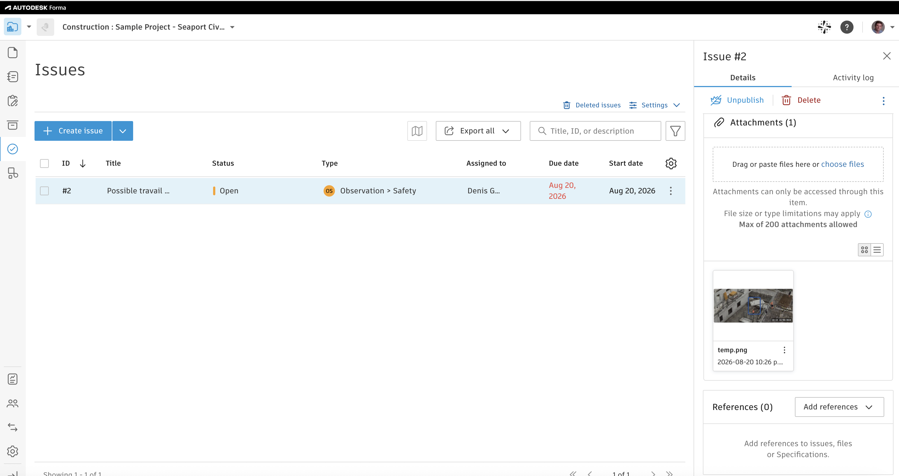

## APS-ENLAPS_POC

Collection of libraries that facilitates integration of the “Safety Feed” 
feature developed by Enlaps on the Autodesk Forma

### APS-SSA library

Standalone library facilitating use of Autodesk Platform Services **Service
Account Authentication (SSA)** — a machine identity for server-to-server calls.

Its purpose here is to provide SSA support to **aps-forma-issues** library, 
but it can be used in other context, too. Check [aps-ssa-sample](./aps-ssa/sample)

### APS-FORMA-ISSUES library

Library facilitating use of APS APIs to record into APS Forma safety issues, 
along with photo proof.

Check [aps-forma-issue-sample](./aps-forma-issues/sample) on how to use the 
library, to get an Issue created providing title, description, date and 
supporting image:

