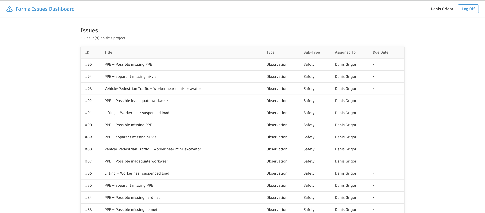
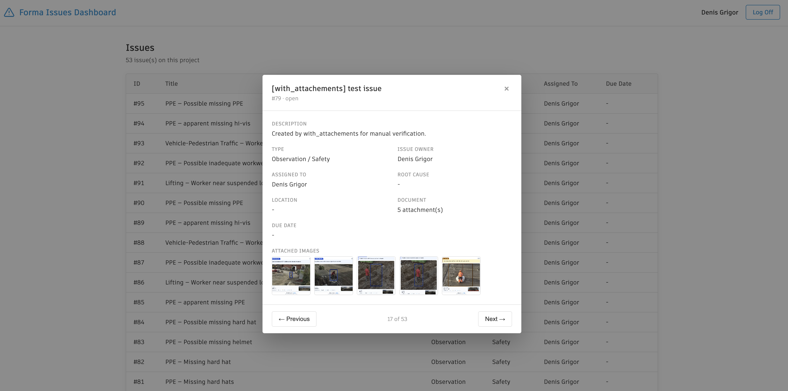

# aps-forma-issues web dashboard (3-legged OAuth)

A small Flask app illustrating `aps_forma_issues`'s read-side calls
(`list_issues`, `get_issue_types`) behind a real 3-legged OAuth sign-in.





## Setup

```bash
uv sync --all-packages     # installs aps-forma-issues + this sample's deps
cp .env.example .env       # then fill in real values, see below
```

## Run

```bash
uv run python run.py
```

Then open http://localhost:5000:

1. **Landing page** — a login dialog explains what's being requested,
   then redirects to Autodesk's sign-in/consent page.
2. **Dashboard** — a table of every Issue on the project (ID, Title,
   Type, Sub-Type, Assigned To, Due Date).
3. **Detail view** — click any row to open a modal with the full
   picture (Title, Description, Type, Issue Owner, Assigned to, Root
   Cause, Location, Document, Due Date, and thumbnails of any attached
   images) and Previous/Next buttons (also bound to the ← / → arrow
   keys) to page through every issue without closing the modal. Click
   a thumbnail to zoom it full-screen.

All issues are fetched once per dashboard load and embedded in the page
as JSON — Previous/Next is instant, client-side navigation through that
same array, not a fetch per click. Attachment thumbnails are the
exception: they're fetched lazily, per issue, only once its modal opens.

## References

- [Retrieve issues tutorial](https://aps.autodesk.com/en/docs/acc/v1/tutorials/issues/retrieve-issues/) - how the issues list are retrieved

- [Retrieve Issue Attachments](https://aps.autodesk.com/en/docs/acc/v1/tutorials/issues/retrieve-issue-attachments/) - how the issue related image urns are retrieved

- [Download Issue Attachments](https://aps.autodesk.com/en/docs/acc/v1/tutorials/issues/download-issue-attachments/) - how the issue related images are downloaded

## Knowing limitations of this sample

- **Single-page listing**: it shows only first 200 issues [`list_issues(limit=200)`] 
  For more than 200 issues would need to follow
  `pagination.next`, which this sample doesn't implement.

- **No token refresh**: a 3-legged access token lasts 60 minutes; this
  sample doesn't use the `refresh_token` it stores, so sign in again if
  the dashboard starts getting 401s after sitting idle and it will require relogin.
